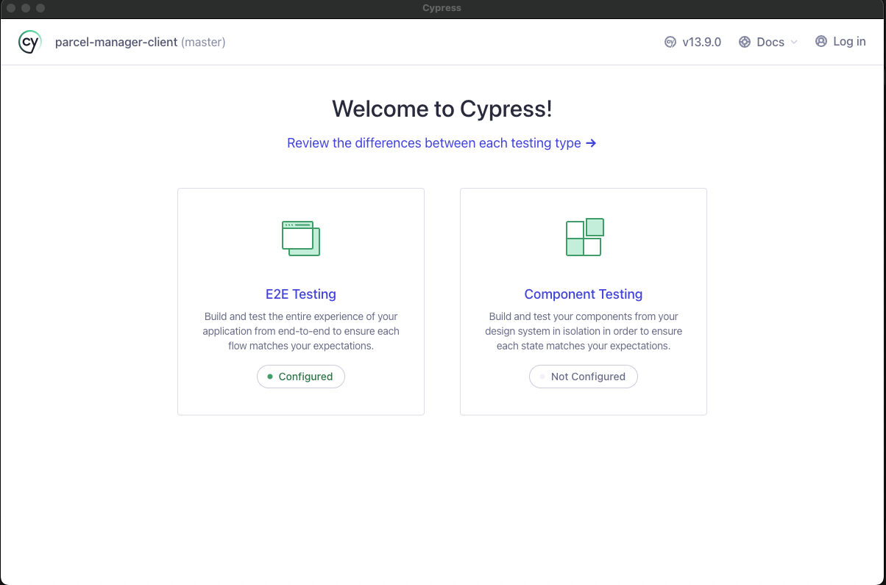
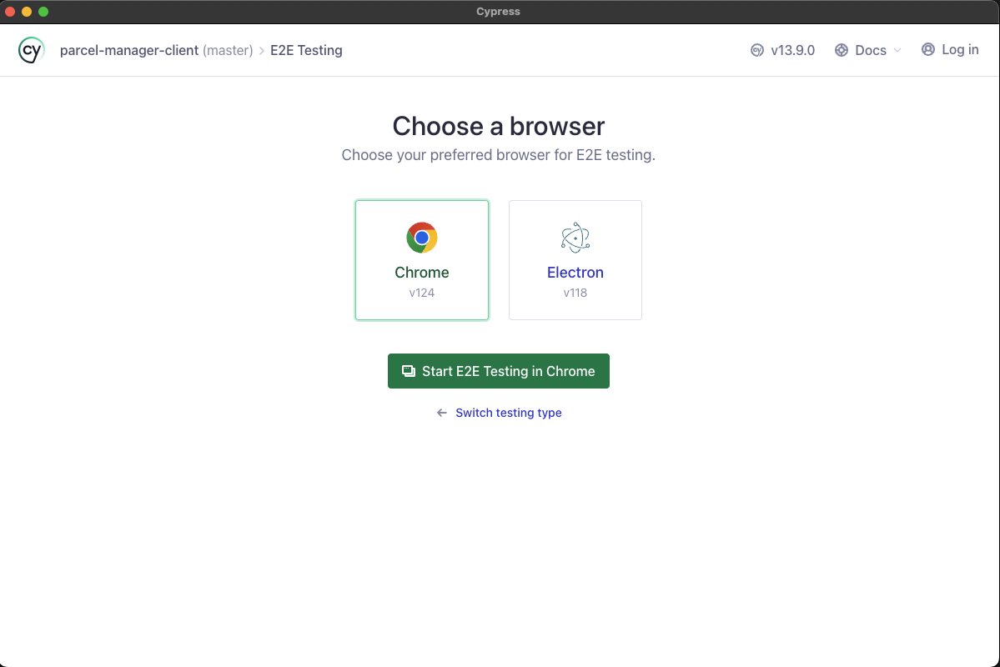
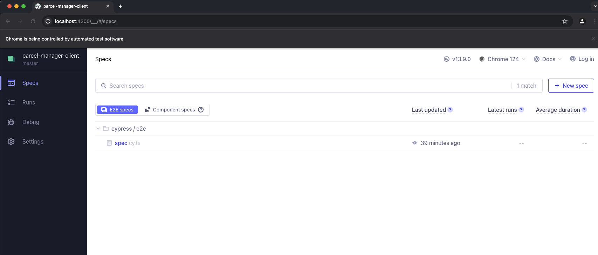

# Parcel Manager Web App

## Installation:

- In your desired directory, run the following commands:

`git clone https://github.com/sjdnz93/parcel-manager.git`

`cd parcel-manager`

`code .` (if using Visual Studio Code. Otherwise open the .sln file)

## Migrate DB and start API

- From `parcel-manager` directory, run the following commands:

`cd backend`

`cd ParcelApi`

`dotnet ef migrations add InitialCreate`

`dotnet ef database update`

`dotnet run`

- NOTE ⇒ the migrate and database update steps are only required the first time you start the API
- NOTE ⇒ to delete the database, delete the `Migrations` folder and `ParcelManager.db` file from the `ParcelApi` directory. You will need to remigrate and update the database again

API can be tested either through the Client (instructions below) or by visiting once API has been started: https://localhost:7022/swagger/index.html

## Start Angular Client

- From `parcel-manager` directory, run the following commands:

`cd frontend`

`cd parcel-manager-client`

`npm install`

`ng serve` (make sure you’ve also started the API)

- NOTE ⇒ install step only necessary for the first time you start the client

## Tests:

I’ve added a small selection of unit tests for the API. These largely cover any helper functions I created. There are a couple of tests for some of the Controllers and Services too. While I understand the necessity for testing both Controllers and Services, the implementation of the tests proved fairly tricky. Great takeaway here is that I’ve got some additional learning to do to properly familiarise myself with testing these aspects of an API!

I’ve also added one ‘happy path’ automation test for the frontend, using Cypress. This was a testing framework I began learning in my previous junior engineering role, and thought it’d be fun to implement something basic here. Note, the test is fairly brittle at the moment (I grab elements by their text rather than a dedicate test tag, etc). Definitely room for improvement, but it’s nice to have one full end-to-end test present.

### API tests:

- From `backend` directory, run the following commands:

`cd Tests`

`dotnet test`

### Cypress tests:

- From `ParcelApi` directory, run the following commands:

`dotnet run`

- Then, from `parcel-manager-client` directory, run the following commands:

`ng serve`

- Then, in a new terminal window, from `parcel-manager-client` directory, run:

`npx cypress open`

- This should open the following window:

- Click the E2E testing option

- Select your browser

- Click the `spec` file. Automated tests will start automatically